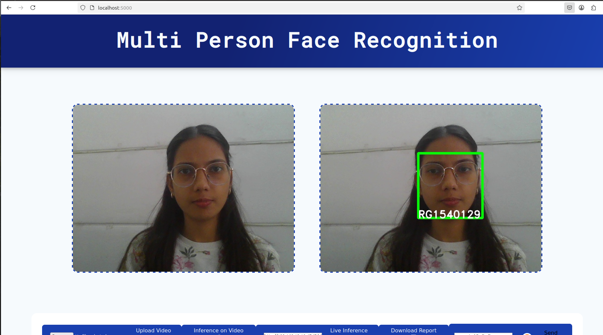

<h1>Multi-Person Face Recognition System</h1>

<h2>1. Overview</h2>

This project is a real-time multi-person face recognition system built using Python, OpenCV, dlib, and Flask. 
It detects and recognizes multiple faces simultaneously from a webcam or video file and streams the processed 
output through a browser interface. Facial embeddings are generated using dlib’s 128-dimensional face encoding 
model and matched against stored known encodings. The project was developed as part of AIML training and 
enhanced with real-time inference, webcam integration, and modular structure.

<h2>2. Features</h2>
<ul>
  <li>Real-time face detection and recognition</li>
  <li>Supports webcam and video input</li>
  <li>Generates facial embeddings from training images</li>
  <li>Flask-based dashboard for live streaming</li>
</ul>

<h2>3. Project Architecture</h2>
<ol>
  <li>Training images are processed to generate facial embeddings.</li>
  <li>Embeddings are saved into a serialized file for matching.</li>
  <li>The real-time recognition script captures video frames.</li>
  <li>Faces are detected and converted into embeddings.</li>
  <li>Embeddings are compared with stored encodings.</li>
  <li>Processed video frames are streamed through Flask.</li>
</ol>

<h2>4. Tech Stack</h2>
<ul>
  <li>Python</li>
  <li>OpenCV</li>
  <li>dlib</li>
  <li>face_recognition library</li>
  <li>Flask</li>
  <li>Pandas</li>
  <li>HTML and CSS</li>
</ul>

<h2>5. Folder Structure</h2>
<pre>
Multi-Person-Face-Recognition/
│
├── src/
│   ├── app.py
│   ├── dlib_face_recognition.py
│   ├── dlib_face_embeddings.py
│   ├── database_pandas.py
│   ├── parameters.py
│   ├── custom_logging.py
│   ├── locks.py
│   └── util/
│
├── templates/
│   └── index.html
│
├── static/
│   │   └── styles.css
│   └── live_flask_server.png/
│
├── requirements.txt
├── README.md
└── .gitignore
</pre>

<h2>6. Installation</h2>

<h3>Step 1: Clone the repository</h3>
<pre>
git clone https://github.com/yourusername/Multi-Person-Face-Recognition.git
cd Multi-Person-Face-Recognition
</pre>

<h3>Step 2: Create a virtual environment</h3>
<pre>
python3 -m venv myenv
source myenv/bin/activate
</pre>

<h3>Step 3: Install dependencies</h3>
<pre>
pip install -r requirements.txt
</pre>

<h2>How It Works</h2>

<h3>Step 1: Prepare Dataset</h3>

Create a folder named <code>dataset</code> and place subfolders for each person you want to recognize. 
Each subfolder should contain multiple images of that person. The subfolder name automatically becomes the label.

<pre>
dataset/
   Person1/
       img1.jpg
       img2.jpg
   Person2/
       img1.jpg
       img2.jpg
</pre>

<h3>Step 2: Generate Encodings</h3>

Run the embedding script to generate facial encodings. This script reads all images from the dataset, 
extracts 128-dimensional facial embeddings using dlib, and stores them in a serialized file.

<pre>
python3 src/dlib_face_embeddings.py
</pre>

This script generates a file named:

<pre>
face_encodings.pkl
</pre>

This file contains all facial embeddings and labels used for recognition.

<h3>Step 3: Real-Time Recognition</h3>

Start the Flask application to begin real-time face recognition from the webcam or video feed.

<pre>
cd src
python3 app.py
</pre>

<h3>Step 4: Access Through Browser</h3>

You can access the real-time video streams using the URLs below:

<h3>Step 5: Screenshot of the Live Flask Server</h3>

A screenshot of the real-time recognition output is provided for reference. 
It demonstrates how the processed video stream appears in the browser when the system is running.

<pre>

</pre>

